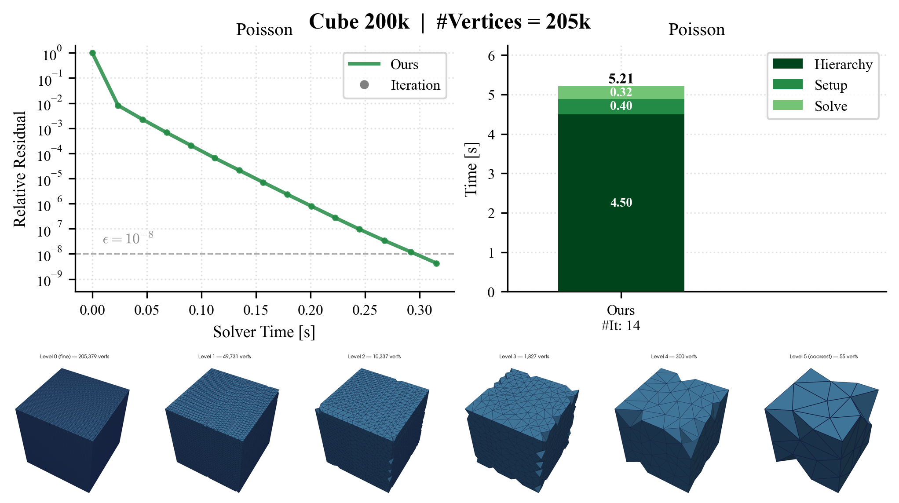
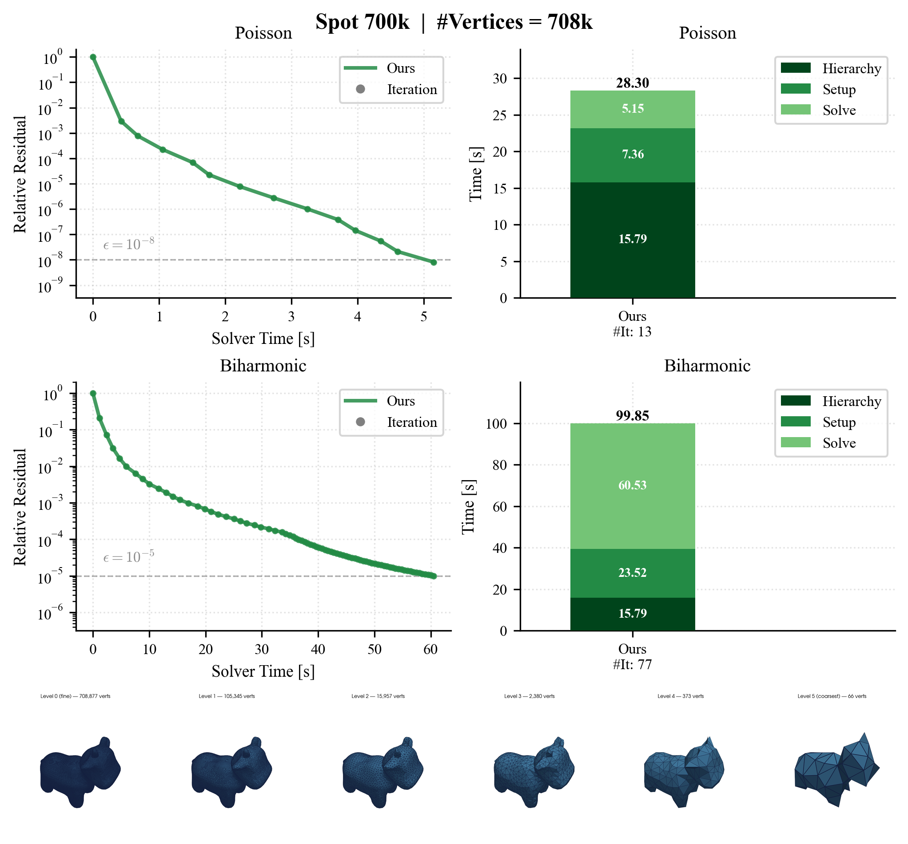
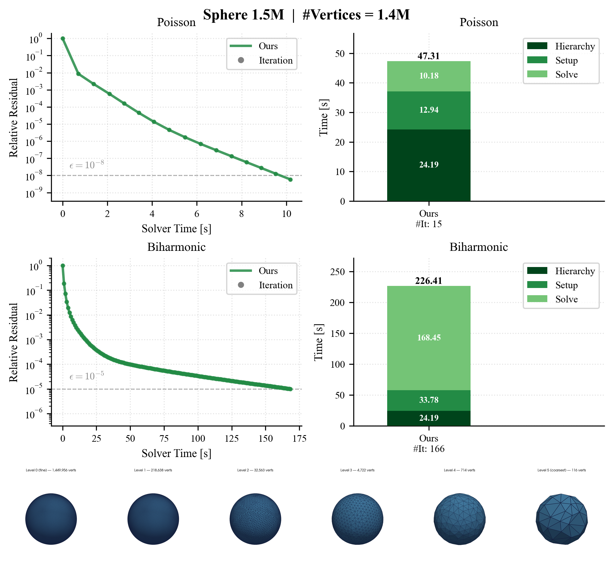
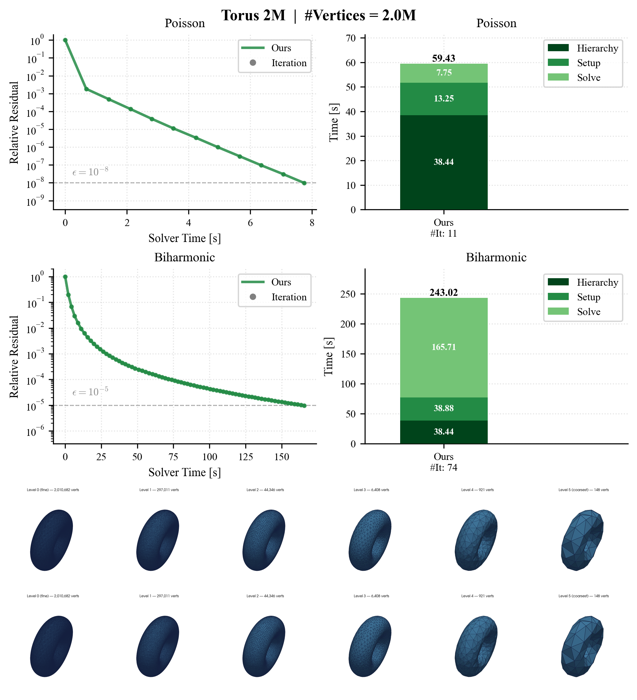

# GravoTet - Supplementary Code

<p align="center">
  <a href="https://marcelpadilla.com/GravoTet">
    
  </a>
</p>

Reference implementation for **GravoTet: A Fast Multigrid Hierarchy
Construction for Tetrahedral Meshes**, presented at Shape Modeling
International (SMI) 2026, Istanbul, and published in the _Computers & Graphics_
SMI 2026 Special Issue.

Marcel Padilla<sup>1</sup>, Ruben Wiersma<sup>1</sup>, Tim Huisman<sup>2</sup>, Jackson Campolattaro<sup>2</sup>, Olga Sorkine-Hornung<sup>1</sup>, Klaus Hildebrandt<sup>2</sup>

<sub><sup>1</sup> ETH Zürich &nbsp;&middot;&nbsp; <sup>2</sup> Delft University of Technology &nbsp;&middot;&nbsp; correspondence: marcel.padilla@inf.ethz.ch</sub>

## Abstract

> Geometric multigrid (GMG) methods are a fundamental tool for efficiently
> solving large sparse linear systems. A requirement for GMG is a hierarchy
> of grids; however, many practical volumetric domains are available only as
> single, irregular tetrahedral meshes, making the construction of a multigrid
> hierarchy necessary. Existing approaches often trade off speed against
> hierarchy quality: remeshing- or coarsening-based methods can be expensive
> to construct, whereas graph-based techniques are fast but often yield weaker
> multigrid performance. We introduce **GravoTet**, which bridges this gap by
> combining geometric structure with graph-based efficiency to construct fast
> and effective multigrid hierarchies. GravoTet builds a vertex hierarchy and
> then generates graph-Voronoi diagrams whose dual cells define coarse
> tetrahedra, enabling rapid construction of multigrid levels. Boundary
> elements are explicitly prioritized during both sampling and tet generation
> to preserve boundary. In our evaluation, we solve Poisson and biharmonic
> problems on irregular tetrahedral meshes and compare GravoTet against
> state-of-the-art geometric multigrid, algebraic multigrid and direct
> solvers, demonstrating superior performance, particularly on large meshes.

## Clone and run

```bash
python run_demo_cube_200k.py     # runs out of the box, finishes in seconds
python run_demo_spot_700k.py     # ~2 min
python run_demo_sphere_1.5M.py   # ~5 min
python run_demo_torus_2M.py      # ~10 min
```

The cube is generated in C++ and needs no input. The other three meshes ship in
the repository and are reassembled on first run, with no download. Every driver
also accepts `--problems`, `--max-cycles`, and `--verbose`.

## Results

**Cube — 205k vertices** _(seconds)_


**Spot — 709k vertices** _(~2 min)_


**Sphere — 1.45M vertices** _(~5 min)_


**Torus — 2.01M vertices** _(~10 min)_


Each run also writes per-level meshes and renders, the prolongation matrices,
and a `data.json` of metrics under `output/<demo>/`.

---

## Requirements and setup

- Python 3.8-3.13
- a C++17 compiler: Xcode Command Line Tools (macOS), GCC or Clang (Linux),
  Visual Studio Build Tools (Windows)
- around 4 GB of free RAM for the 2M-vertex torus demo

On the first run the driver installs any missing Python packages (`numpy`,
`scipy`, `matplotlib`, `pybind11`, `pyvista`, `pillow`) and builds the local
C++ extension via `pybind11`. No conda and no SuiteSparse/CHOLMOD are required:
the V-cycle uses an Eigen `SimplicialLDLT` as its coarse-grid direct solver.

## Third-party code and acknowledgments

This repository vendors the Eigen headers under `code/deps/eigen`; see
[THIRD_PARTY_LICENSES.md](THIRD_PARTY_LICENSES.md). The Spot mesh is derived
from a CC0 surface model by
[Keenan Crane](https://www.cs.cmu.edu/~kmcrane/Projects/ModelRepository/),
tetrahedralized with TetGen.
